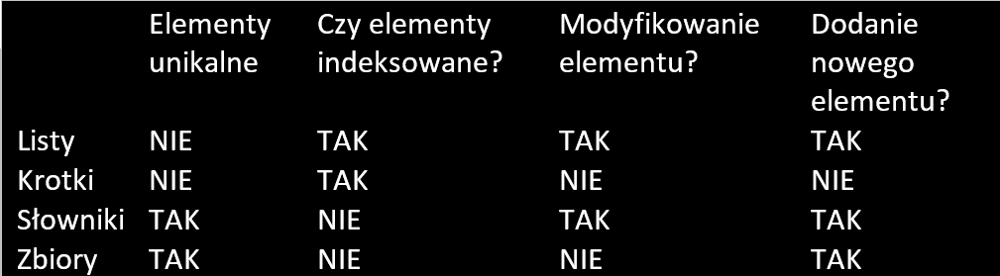

# OPERACJE NA STRINGACH 
1. Stringi są niemutowalne, czyli nie modyfikowalne
    - `imie = Kacper`
    - `imie += ek` -> Kacperek
      - możemy coś dodać do str
    - `imie[0] = "G"` -> TypeError: 'str' object does not support item assignment
    - `imie = imie.replace(K, G)` -> Gacper
      - metoda .replace przyjmuje 2 argumenty i zastępuje pierwszy drugim ale nie modyfikuje bezpośredno str 
        a tworzy nowy więc musimy dokonać operacji przypisania
2. Aby odczytać dowolna literę str:
   - ```litera = wytaz[index]```
3. Wyświetlenie ostatniej litery str:
   - ```print(napis[len(napis) - 1])``` 
     - lepiej użyć ujemnych indexów ```napis[-1]```
4. Wycięcie str
   - ```napis[index_start : index_koniec]``` index_start - włącznie, index_koniec - wyłącznie 
   - ```napis[ : index_koniec]``` zaczynamy od 0 indexu
   - ```napis[index_start :]``` kończymy na ostatnim 
5. Łączenie str
    - ```napis_a + " " + napis_b ``` łączymy dwa wyrazy dodając spacje pomiędzy 
6. Ujemnie indexy
   - ```napis[-1]``` odpowiada ostatniej literze
7. Wykonanie kopi str
   - ```kopia_napis = napis[:]``` 
      zmienne wskazują na różne miejsca w pamięci więc edytowanie jednej nie wpływa na druga
   - ```nowy_napis = napis```
      obie zmienne wskazują na to samo miejsce w pamięci edycja jednej zmienia też druga 
8. Rozdzielanie str
   - ```napis.split(' ')``` 
   funkcja split wydziela tekst na fragmenty .split('to wstawiamy wdg czego chcemy podzielić np spacja, średnik itd') i tworzy z nich listę
9. Łączenie listy w str
   - ```' '.join(lista)``` podobnie jak wyżej łączymy liste w str, elementy listy oddzielone tym co w ``
10. Zmiana wielości liter
    - ```napis = "Devs-MentoRING"```
    - ```napis.lower()``` -> devs-mentoring
    - ```napis.upper()``` -> DEVS_MENTORING
    - ```napis.capitalize()``` -> Devs-mentoring
    - ```napis.title()``` -> Devs-Mentoring
    - ```napis.swapcase()``` -> dEVS-mENTOring
11. Usuwanie białych znaków
    - ```"     przykład".lstrip()``` "przykład" usuwanie z lewej 
    - ```"   przykład    ".rstrip() "``` "    przykład" usuwanie z prawej 
    - ```"   przykład    ".strip()``` "przykład" usuwanie z oby
12. Wstawianie zmiennyc do str
    - `imie = Adam` `wiek = 20`
    - `print("Witaj", imie)` -> Witaj Adam 
      - tym sposobem zmienna zawsze dodwana jest na końcu
    - `print(f"Witaj {imie} masz {wiek} lat)` -> Witaj Adam masz 20 lat 
      - f-string zmienne dodajemy do str w {}
    - `print("Witaj {} masz {} lat.format(imie, wiek))` -> Witaj Adam masz 20 lat 
      - .format() w stringu zostawiamy puste {} a zmienne przekazujemy jako argumenty metody .format()
13. Operacje arytmetyczne na f-stringach
    - `print(f"mnożenie = {300 * 20})` ->  mnożenie = 6000
    - `wartosc = 1.92999`
    - `print(f"{wartosc:.3f})` -> 1.930
      - zaokrąglenie do 3 miejsc po przecinku
14. f-stringi są dużo szybsze w działaniu niż inne sposoby formatowania kodu
15. Określenie rodzaju napisu
    - `napis.isalnum()`
      - sprawdza czy napis składa się tylko alfanumerycznych (A-Z, a-z, 0-9) 
    - `napis.isdigit()`
      -  cyfr
    - `napis.isalpha()`
      -  liter
    - `napis.isspace()`
      - białe znaki
    - `napis.islower()`
      - małe litery
    - `napis.isupper()`
      - duże litery
    - `napis.istitle()`
      - postać tytuły (każde słowo zaczyna się od wielkiej litery)
16. Wzorce w tekście
    - `napis = "Nauka programowania Python"`
    - `napis.find("Python")` -> 20
    - `napis.index("Python")` -> 20
      - Jedyna różnica między tymi metodami to w przypadku nie znalezienia wzorca index() zwraca błąd, find() zwraca -1
17. Zabezpieczenie str dodając try expect 
    - ```
      try:
         liczba = int(input("Podaj liczbę: ")) <- 2
         print(f"{liczba} + {liczba} = {liczba + liczba}") -> 2 + 2 = 4
      except ValueError:
         print("Podałeś zmienną o złym typie zwrócono wyjątek ValueError")
      ```
# ZŁOŻONE STRUKTURY DANYCH
## LISTY []
1. Definicja listy
   - `lista = []`
   - `list([wartosc])`
2. Dodawanie do listy nowego elementu
   - `lista.append("Paweł")`
3. Sprawdzenie czy element jest na liście
   - `if "Paweł" in lista:` `if Paweł not in lista:`
4. Odczytanie długości listy
   - `len(lista)`
5. Dodanie kilku elementów (listy) do listy
    - `lista.extend([Adam, Jarek])`
6. Sortowanie listy
   - rosnąco
     - `lista.sort()`
   - malejąco
     - `lista.sory(reverse=True)`
7. Usuwanie elementu z listy
   - `lista.pop(index_elementu)`
8. Największa wartość listy
   - `max(lista)`
9. Najmniejsza wartość listy
   - `min(lista)`
10. Dodawanie do listy po indexie
    - `lista.insert(index, "Jan")`
11. Odwracanie listy
    - `lista.reverse()`
12. Powielanie zawartości listy
    - `lista * 2`
13. Przetwarzanie listy w pętli
    - ```
      imiona = [‘Kacper’, ‘Jan’, ‘Elżbieta’, ‘Joanna’] # tworzymy listę imion
      for imie in imiona: 
        print(imie) # wyswietlamy kazde pojedyczne imię
      ```
## KROTKI ()
1. Krotki to listy niemutowalne czyli niezmienne 
2. Definicja krotki
   - `krotka = (1, 2, 3, 4)`
   - `tuple([wartosc])`
## SŁOWNIKI {}
1. Słowniki przechowują pary {klucz : wartość} klucz musi być unikalny
2. Definicja słownika klucz imie, wartośc wiek
    - `slownik_wieku = {"Marianna" : 30, "Izabela" : 15, "Józef" : 53}`
    - `dict([klucz1 : wartosc1])`
3. Wyświetlanie słownika
   - wydrukuje cały słownik
     - `print(slownik_wieku) -> {"Marianna" : 30, "Izabela" : 15, "Józef" : 53}` 
   - wydrukuje to co pod kluczem
     - `print(slownik_wieku["Józef"]) -> 53`
   - wydrukuje klucze
     - `print(slownik_wieku.keys()) -> dict_keys(['Marianna', 'Izabela', 'Józef'])`
   - wydrukuje wartości
     - `print(slownik_wieku.values()) -> dict_values([30, 15, 53])`
4. Dodawanie kolejnych elementów do słownika
   - `slownik.wieku.update({"Kacper" : 33})`
     - możemy dodawać wiele wartości\
       - `slownik.wieku.update({"Kacper" : 33, "Pawel" : 10})`
5. Metoda .get(klucz, x) x - wartość, którą metoda zwróci jeśli klucz nie istnieje 
   - `print(slownik_wieku.get("Marianna", "Nieznany klucz!")) -> 30`
   - `print(slownik_wieku.get("Robert", "Nieznany klucz!")) -> Nieznany klucz!`
6. Pobieranie wszystkich wartości ze słownika w postaci listy
   - `print(slownik_wieku.values()) -> dict_values([30, 15, 53])`
7. Pobieranie wszystkich kluczy z słownika w postaci listy
   - `print(slownik_wieku.keys()) -> dict_keys(['Marianna', 'Izabela', 'Józef'])`
8. Pobieranie zarówno kluczy jak i wartości
   - `print(slownik_wieku.items()) -> dict_items([('Marianna', 30), ('Izabela', 15), ('Józef', 53)])`
## ZBIORY {}
1. Zbiory przechowują unikalne wartości w strukturze nieuporządkowanej nie można odwołać się po index
2. Konwersja listy na zbiór np dla odfiltrowania powtarzających się wartości `set(lista)`
   - ```
     lista = [1, 1, 2, 2, 3, 3]
     unikalne_elementy = set(lista)
     print(unikalne_elementy) -> {1, 2, 3}
     ```
3. Definicja zbioru
   - `zbior = {1, 2, 3}`
   - `set([wartosc])`
4. Dodanie wartości do zbioru
   - `zbior.add(4)`
     - dodaje jedne element
   - `zbior.update({5, 6})`
     - można dodać więcej elementów
5. Usunięcie wartości ze zbioru
   - `zbior.remove(1)`
   - `zbior.discard(1)`
     - w momencie gdy usuwany element nie istnieje remove rzuca wyjątek, discard nic wywołuje żadnych działań
6. Łączenie zbiorów
   - `zbior1 | zbior2`
   - `zbior1.union(zbior2)`
7. Część wspólna zbiorow
   - `zbior1 & zbior2`
   - `zbior1.intersection(zbior2)`
8. Różnica zbiorów
   - `zbior1 - zbior2`
   - `zbior1.difference(zbior2)`
9. Symetryczna różnica zbiorów znajduje elementy, które są w zbior1 i zbior2 
   ale nie należą równocześniej do obu
   - `zbior1 ^ zbior2`
   - `zbior1.symmetric_difference(zbior2)`
## Podsumowanie

## ZAGNIEŻDŻONE STRUKTURY DANYCH
1. Przykład struktury zagnieżdżonej słownik w którym umieszczamy listy
    ```
    przepis = {
        'naleśniki' : ['jaja', 'mąka', 'sól', 'mleko', 'dżem'],
        'kanapki z serem' : ['chleb pełnoziarnisty', 'ser żółty', 'masło', 'pomidor'] 
    }
    
    ```
2. Modyfikacja elementu
   - `przepis.get('naleśniki')[0] = 'jaja kurze'`
     - pobieramy cała listę z słownika znajdującą się pod kluczem naleśniki 
       oraz zamieniamy element o index 0 na wartosc jaja kurze
3. Dodanie nowej pary klucz wartosc
   - `przepis.update({'spaghetti' : ['makaron', 'mięso mielone', 'pomidory']})`
4. Przetwarzanie danych w zagnieżdżonej strukturze przy pomocy pętlki
    - ```
      osoby = [
              ['Alicja', 25, ‘blondynka’], # 1 zagnieżdżona lista
              ['Bob', 33, ‘brunet’], # 2 zagnieżdżona lista
              ['Anna', 18, ‘szatynka’] # 3 zagnieżdżona lista
              ]
      ```
        - `osoby[0][0] = "Patrycja"`
          - zamieniamy element z listy 0 i indexie 0 (kolejność) Alicja na Patrycja 
    - iteracja po wszystkich zagnieżdżonych elementach
      - ```
        for osoba in osoby:
            for elem in osoba:
                print(elem) # wyswietlamy poszczegolne elementy z list

        ```
## Pozostałe typy danych
1. frozensety - to struktury danych o charakterystyce zwykłych setów, ale są one niemutowalne
2. namedtuple - to struktury danych, które przypominają tuple, z tą różnicą do poszczególnych elementów 
   odwołujemy się już nie przy użyciu indeksów, ale nazwanych kluczy. Pomaga to w zarządzaniu elementami 
   i identyfikowaniu ich z konkretnymi nazwami.
3. frozendicty
4. memsety
# FUNKCJE
1. Definicja funkcji
   - ```
     def wyswietl_przywitanie(imie_u, imie_r):
        print("Imię ucznia", imie_u)
        pritn(Imię rodzica", imie_r)
     ```
2. Wywołanie funkcji
    - ```
      imie_ucznia = input("Podaj imie ucznie: ") <- Adam
      imie_rodzica = input("Podaj imie rodzica: ") <- Paweł
      wyswietl_przywitanie(imie_ucznia, imie_rodzica) -> Imie ucznia Adam -> Imie rodzica Paweł 
      ```
        - podczas definicji funkcji utworzyliśmy dwa printy, które sa drukowanie po wywołaniu funkcji
        - argumenty funkcji podajemy w kolejności, w której zostaną przekazane 
3. Parametry funkcji:
   - `imie_u, imie_r`
     - parametry deklarujemy zaraz po nazwie funkcji, w definicji funkcji
   - możemy również utworzyć funkcje bezparametrowa, nie przyjmuję ona wówczas żadnych argumentów 
     może to być na przykład funkcja odliczająca do 10 
   - `bez_parametru()`
      - wywołanie funkcji bezparametrowej
4. Argumenty funkcji
   - `imie_ucznia, imie_rodzica`
     - argumenty to konkretne wartości, które przekazujemy do funkcji w momencie jej wywołania 
5. Ciało funkcji 
   - ```
     print("Imię ucznia", imie_u)
     pritn(Imię rodzica", imie_r)
     ```
     - umieszczamy w niej to co ma zostać wykonane należy pamiętać o wcięciu poprzedzającym każda linie ciała
6. Keyword arguments (argumenty nazwane)
    - ```
      def powitaj(powitanie, imie, wiek, narodowosc):
        print(f"{powitanie}. Masz {wiek} lat. Jesteś narodowości: {narodowosc}")
      
      powitaj(wiek=10, powitanie="Witaj", imie="Jan", narodowosc="Polska) 
      -> Witaj, Jan. Masz 10 lat. Jesteś narodowości: Polska
      ```
        - keyword pozwalają na przesyłanie argumentów sposobem parametr=wartość, kolejność jest dowolna 
7. Default arguments (argumenty domyślne)
    - ```
      def powitaj(powitanie, imie=Jan, wiek=10, narodowosc="Polska):
        print(f"{powitanie}. Masz {wiek} lat. Jesteś narodowości: {narodowosc}")
      
      powitaj(powitanie="Hej")
      -> Hej, Jan. Masz 10 lat. Jesteś narodowości: Polska
      powitaj(powitanie="Witaj, imie="Jerzy, wiek=70, narodowosc="USA")
      -> Witaj, Jerzy. Masz 70 lat. Jesteś narodowości: USA
      ```
        - argumenty domyślne umożliwiają automatyczne wstawianie za dany argument wartości
          jeżeli nie został on wysłany podczas wywołania
8. Argumenty funkcji *args i **kwargs
    - `*args` Non-Keyword Arguments pozwala na przesłanie dowolnej liczby argumentów trochę jak krotka
      - ```
        def sumuj_liczby(*args):
            suma = 0
            for val in args:
                suma += val
            
            return suma
        
        print(sumuj_liczby()) -> 0
        print(sumuj_liczby(1)) -> 1
        print(sumuj_liczby(1, 2, 3, 4, 5)) -> 11
        ```
    - `*args` to obiekt po którym możemy iterować ale nie możemy zmienić jego wartości z poziomu funkcji
      - ```
        def testuj_args(*args):
            print(*args) -> 1 2 3 5
            args[0] = 3 -> error
            print(args[0]) -> 1
            print(args[-1]) -> 5
        
        testuj_args(1, 2, 3, 5)
        ```
    - `**kwargs` pozwala na przesłanie dowolnej liczby par klucz(nazwa argumentu) :  wartość(wartość argumentu)
       troche jak słownik
      - ```
        def wyswietl_zespol(**kwargs):
            print(kwargs['product_owner']) -> Kacper
            for klucz in kwargs:
                print(f"{klucz}: {kwargs[klucz]}")
                -> product_owner: Kacper
                -> manager: Filip
                -> programer: Jacek
        
        wyswietl_zespol(product_owner="Kacper", manager="Filip", programer="Jacek")
        ```
        - `print(kwargs['product_owner']) -> Kacper` nazwę klucza umieszczamy między ''
    - jeśli chcemy łączyć wyrażenie to zawsze jako ostatni parametr `**kwargs`, przed ostatni `*args`
      - ```
        def wyswietl_zespol(nazwa_zespolu, *args, **kwargs):
            .
            .
            .
        wyswietl_zespol("Team 9", 1, 2, 3, product_owner="Kacper", manager="Filip", programer="Jacek")
        ```
9. Return służy do wysyłania danego rezultatu po zakończeniu działania funkcji 
   gdy funkcja napotka słowo return kończy działanie i zwraca tą wartość
   - ```
     def oblicz_srednia(lista):
        retuen sum(lista)/ len(lista)
     
     liczby = [1, 2, 3]
     print(oblicz_srednia(liczby)) -> 2.0
     ```
   - Zwracanie wielu wartości równocześnie return zwróci krotkę:
     - ```
       import statistics as st

       def pobierz_dane(lista):
          srednia_arytm = st.mean(lista)
          odchylenie_stand = st.stdev(lista)

       return srednia_arytm, odchylenie_stand

       liczby = [1, 2, 3]
       print(pobierz_dane(liczby)) -> (2, 1.0)
       ```
        - `return [srednia_arytm, odchylenie_stand]` zwróci listę
10. Funkcja główna programi main() i jej wywołanie
    - ```
      def main():
        .
        .
        .
      
      if __name__ == "__main__":
        main()
      ```
        - dzięki takiej budowie aplikacji pierwsze co robi interpreter to wyszukuje funkcji main i ją wywołuje
          funkcja main służy do wywoływania dalszej części programu pozostałych klas funkcji itd
11. Zmienne lokalne
    - zmienne zdefiniowane w dowolnej funkcji mają ograniczony zakres widoczności jedynie do funkcji,
      w której zostały stworzone
12. Zmienne globalne
    - Staramy się unikać wykorzystania zmiennych globalnych
    - Aby utworzyć zmienną globalna wewnątrz funkcji podczas jej definicji dodajemy przedrostek global
      - ```
        def funkcja():
            global zmienna_globalna
            zmianna_globalna = 1
            funkcja_2()
        
        def funkcja_2():
            print(zmianna_globalna) -> 1
        
        if __name__ == "__main__":
            funkcja()
        ```
# PLIKI
1. Sposoby manipolwoania plikami, uchwyty do pliku
   - "r" read służy do odczytu
   - "a" append dodaj
   - "w" write służy do nadpisywania zawartości
   - "x" create tworzy plik
2. Otwierani i tworzenie uchwytu do danego pliku
   - `plik = open(plik.txt, "r")` plik otwarty do odczytu
3. Zamykanie pliku, otwarty plik trzeba zawsze zamknąć
   - `plik.close()`
4. Kodowanie znaków domyślnie ASCII
   - `plik = open(plik.txt, "r", encoding="utf-8")`
     - `encoding="utf-8"` kodowanie UTF-8 zawiera polskie znaki
5. Postać binarna uchwyty do pliku
   - "rb" tryb czytania pliku binarnego
   - "wb" tryb zapisy pliku binarnego
6. Postać bitowa obiektu
   - ```
     liczby = [1, 2, 10, 15]
     bin_lista = bytarray(liczby)
     ```
        - polecenie `bytarray()` zwraca postać bitową danego obiektu
7. Czytanie z pliku 
   - `plik.read(ilosc_znakow)`
     - czyta określoną ilość znaków zaczynając od miejsca, w którym się obecnie znajdujemy
   - `plik.readline()`
     - czyta zaczynając od miejsca, w którym się znajdujemy do znaku nowej lini
   - `plik.readlines()`
     - czyta całą zawartość pliku
8. Zapis do pliku
   - `plik.write(tekst)`
     - zapisuje podany w argumencie tekst
   - `plik.writelines(lista)`
     - zapisuje tekst z listy ciągiem, aby każdy element listy był nową linią trzeba dodać do nich \n
9. Context manager nowy lepszy bardziej pythonowy sposób obsługi plików
   - `with open(sciezka, "uchwyt") as nazwa_zmiennej:`
     - operacje na plikach zapisujemy wewnątrz, plik automatycznie zamykany po wyjściu z with, przykład
       - ```
         with open("przyklad.txt, "w") as plik:
            plik.write("Przykładowy tekst")
         ```
10. Zarządzanie wskaźnikiem 
    - `plik.seek(2)`
      - pozwala przemieście wskaźnik na określony w argumencie numer litery w tekście
    - `plik.tell()`
      - zwraca numer litery z tekstu, na której znajduje sie wskaźnik 
    - separatory przejścia do nowej linii "\n" również są liczone jako litery 

# KLASY
1. Obiekt klasy inaczej instancja to powołana do życia gdzieś w pamięci ram klasa, obiekt jest reprezentantem klasy
    ```
    class Czlowiek:
        def __init__(self, imie, plec, wiek):
        self.imie = imie # tworzymi i inicjalizujemy pole imie 
        self.plec = plec # tworzymi i inicjalizujemy pole plec
        self.wiek = wiek # tworzymi i inicjalizujemy pole wiek
        self.opisz_osobe() # wywołanie metody wewnątrz klasy
        
        def opisz_osobe(self):
            print(f"Imie: {self.imie}, płeć: {self.plec}, wiek: {self.wiek}")
            # dla obiektu klasy osoba1
            -> Imie: Kacper, płeć: M, wiek: 45
            # dla obiekty klasy osoba2 
            -> ImieL Kinga, płeć: K, wiek: 20
        
    def main():
        osoba1 = Czlowiek("Kacper", "M", 45) # tworzymy pierwszy obiekt
        osoba2 = Czlowiek("Kinga", "K", 20) # tworzymy drugi obiekt
        
        print("Imię pierwszej osoby to: ", osoba1.imie) # wyświetlamy umię pierwszego obiektu
        -> Imie pierwszej osoby to: Kacper
    
    if __name__ == "__main__"
        main()
    ```
2. Metoda specjalna zwana konstruktorem __init__()
    - jest to metoda magiczna, która jest zawsze automatycznie uruchamiana przy tworzeniu nowych obiektów klass
    - konstruuje ona obiekt danej klasy czyli umożliwia sprecyzowanie jakie wartości pól będzie on przechowywał
3. self używamy aby
    - utworzyć i skojarzyć określone pole z tworzoną klasą w __init__()
    - nadać wartość danemu polu 
    - dzięki self możemy odwoływać się do pol klasy w każdej metodzie wewnątrz tej klasy
    - pozwala wywoływać metody wewnątrz klasy
4. Pola prywatne i chronione raczej nie używane w python
    - nazwa zmiennej zaczynająca się od __zmienna jest traktowana jako prywatna private
      - do pola prywatnego nie mamy dostępu poza klasą oraz nie jest ono dziedziczone
      - do obsługi pól prywatnych używamy getterów i setterów 
    - nazwa zmiennej zaczynająca się od _zmienna jest traktowana jako chroniona protected
      - pole chronione sugeruje, że nie powinno być ono bezpośrednio dostępne z zewnątrz klasy 
        jednak interpreter nie wymusza tego
      - technicznie można uzyskać dostęp do pola chronionego z zewnątrz klasy jednak jest to uważane za zła praktyke
    ```
    class Pojazd:
        def __init__(self, ilosc_kol, marka, kolor_lakieru):
            self.__ilosc_kol = ilosc_kol
            self._marka = marka
            self.kolor_lakieru = kolor_lakieru
        
        def get_ilosc_kol(self):
            '''getter pola __ilosc_kol'''
            return self.__ilosc_kol
        
        def set_ilosc_kol(self, ilosc_kol):
            '''setter pola __ilosc_kol'''
            self.__ilosc_kol = ilosc_kol
    
    def main():
        samochod_osobowy = Pojazd(4, "Audi", "niebieski")
        
        print(samochod_osobowy.__ilosc_kol) -> error # nie można się odwolac do pola prywatnego poza klasą
        print(samochod_osobowy.get_ilosc_kol()) -> 4
        print(samochod_osobowy._marka) -> Audi
        print(samochod_osobowy.kolor_lakiery) -> niebieski
        
        samochod_osobowy.__ilosc_kol = 12 -> error # nie można edytowac pola prywatnego poza klasa
        samochod_osobowy.set_ilosc_kol = 12 -> 12
    
    if __name__ == "__main__"":
        main()
    ```
5. Referencje do obiektów, usuwanie obiektów garbage collection
    ```
   import copy 
   
    class Pudelko:
        def __init__(self):
            self.ilosc_elementow = 4
        
    def main():
        p1 = Pudelko()
        p2 = p1
        p2.ilosc_elelemtow = 8
        
        print(p1.ilosc_elementow) -> 8
   
        p3 = copy.copy(p1)  # shallow copy, kopia płytka
        p3.ilosc_elemetow = 15
        print(p1.ilosc_elementow) -> 8
        print(p1.ilosc_elementow) -> 15
        
        
    if __name__ == "__main__":
        main()
    ```
   - stworzyliśmy dwie referencje p1 i p2 do jednego obiektu, zajmują to samo miejsce w pamięci 
     dlatego edycja p2 zmienia również p1
6. Kopie płytkie i głębokie
    - shallow copy w momencie gdy mamy pole będące obiektem innej klasy w momencie kopiowania 
      takie pole nie jest kopiowane ale jest dowiązywana nowa referencja jak w przypadku p1 = p2 na obiektach klasy
    - deep copy rozwiązuje ten problem tworząc rownież kupie pól obiektow innej klasy 
    ```
    import copy
    class Przedmiot:
        def __init__(self, nazwa):
            self.nazwa = nazwa
    
    class Pudelko:
        def __init__(self, nazwa_przedmiotu):
            self.przedmiot = Przedmiot(nazwa_przedmiotu)
            self.ilosc_elementow = 1
    
    def main():
        pudelko_na_sprzet = Pudelko("laptop")
    
        pudelko_na_nowy_sprzet = copy.copy(pudelko_na_sprzet) # shallow copy
        pudelko_na_nowy_sprzet.przedmiot.nazwa = "Telewzior"
        pudelko_na_nowy_sprzet.ilosc_elementow = 2
        print(pudelko_na_sprzet.przedmiot.nazwa) -> Telewizor 
        print(pudelko_na_sprzet.ilosc_elementow) -> 1 wynik ok
    
        pudelko_na_nowy_sprzet_deepcopy = copy.deepcopy(pudelko_na_sprzet) # deep copy
        pudelko_na_nowy_sprzet_deepcopy.przedmiot.nazwa = "Telewzior"
        pudelko_na_nowy_sprzet_deepcopy.ilosc_elementow = 2
        print(pudelko_na_sprzet.przedmiot.nazwa) # -> laptop
        print(pudelko_na_sprzet.ilosc_elementow) # -> 1
    
    if __name__ == "__main__":
        main()
    ```
# DZIEDZICZENIE
1. Dziedziczenie
    ```
    class Wielokat:
        def __init__(self, boki, suma_katow):
            self.boki = boki
            self.suma_katow = suma_katow
    
        def oblicz_obwod(self):
            return sum(self.boki)
    
        def wyswietl_sume_katow(self):
            print(self.suma_katow) -> 15
    
    
    class Trojkat(Wielokat):
        def __init__(self, a, b, c):
            super().__init__([a, b, c], 180)
    
        def oblicz_pole(self):
            # pole liczone ze wzoru Herona
            a, b, c = self.boki[0], self.boki[1], self.boki[2]
            p = (self.boki[0] + self.boki[1] + self.boki[2]) / 2
            return (p * (p - a) * (p - b) * (p - c) ** 0.5)
    
    
    def main():
        trojkat_rownoramienny = Trojkat(5, 5, 5)
        print(trojkat_rownoramienny.oblicz_obwod()) -> 180
        trojkat_rownoramienny.wyswietl_sume_katow()
        print("{:.4f}".format(trojkat_rownoramienny.oblicz_pole())) -> 74.1159
    
    
    if __name__ == "__main__":
        main()
    ```
   
   - `class Trojkat(Wielokat)` oznacza, że klasa Trojkat dziedziczy po klasie Wielokat
   - `super().__init__([a, b, c], 180)` konstruktor obiektu klasy rodzica
2. Schemat dziedziczenia wielokrotnego 
    ```
    class Parent1:
        def __init__(self):
            super().__init__()
    
    class Parent2:
        def __init__(self)
        
    class Derived(Parent1, Parent2):
        def __init__(self):
            super().__init__()
    
    def main():
        d = Derived()
        print(Derived.mor()) # wyświetla kolejność wywoływania klas
        -> [<class '__main__.Derived'>, <class '__main__.Parent1'>, <class '__main__.Parent2'>, <class 'object'>]
        
    if __name__ == "__main__":
        main()
    
    ```    
    - wywołujemy kalse Derivde() w konstruktorze tej klasy wywołujemy przy pomocy `super().__init__()` 
      klase po której dziedziczymy zawsze wywoływana jest pierwsza podana kalsa czyli Parent1()
      w i znowu w konstruktorze tej klasy wywołujemy druga klase po której dziedziczymy Parent2()
3. Przeładowanie operatorów
    ```
    class Obszar:
        def __init__(self, pole, nazwa):
            self.pole = pole
            self.nazwa = nazwa
    
        def __add__(self, obj):
            return self.pole + obj.pole
    
        def __str__(self):
            return f"pole: {self.pole}, nazwa: {self.nazwa}"
    def main():
        obszar1 = Obszar(100, "obszar1")
        obszar2 = Obszar(200, "obszar2")
        print(obszar1 + obszar2) -> 300
        print(obszar1.__str__()) -> pole: 100, nazwa: obszar1
    
    if __name__ == "__main__":
        main()
    ```
    - poprzez dodanie metody specjalnej __add__ zrealizowaliśmy przeładowanie  
    - `print(obszar1 + obszar2)` bez metody __add__ zwróciło by TypeError
    - metody specjalne nie zawsze są wywoływane w sposób jawny 
      w tym przypadku metodę wywołaliśmy poprzez + w `print(obszar1 + obszar2)`
- inne przykładowe operatory ktore możemy przeładować
  - __sub__ - przeładowany operator odejmowania (realizuje zaimplementowane przez nas odejmowanie dla obiektów danej klasy)
  - __lt__ () - przeładowany operator porównania, zwraca True lub False w zależności od tego, 
    czy sprawdzone przez nas wartości są mniejsze niż dane wartości obiektu porównywanego
  - __eq__ () - sprawdza, czy obiekty mają tę samą zawartość
  - __str__ () - powoduje zwrócenie wartości typu str, która ma reprezentować obiekt, 
    na rzecz którego ta metoda została zwrócona
# KLASY ABSTRAKCYJNE
1. Klasy abstrakcyjne śsą przeznaczone do wydzielania funkcjonalności, które bądą następnie implementowane
   w klasa, które dziedzicą po klasie abstrakcyjnej 
2. Stworzenie obiekty klasy abstrakcyjnej wywoła wyjątek 
   TypeError: Can't instantiate abstract class ExampleAbstractClass with abstract methods do_something
3. Klasa abstrakcyjna wyposaża obiekty we wspólne zmienne, oraz metody, 
   a także wymusza określone metody współpracy z otoczeniem poprzez konieczność definicji abstrakcyjnych metod

    ```
    from abc import ABC

    class Szkolenie(ABC):
    """Klasa abstrakcyjna szkolenie"""

    def __init__(self, szkolenie, zadanie):
        self.szkolenie = szkolenie
        self.zadanie = zadanie
        self.tytul()

    def tytul(self):
        print(f"Wybrałeś szkolenie: {self.szkolenie} i zadanie: {self.zadanie}: ")

    # @abc.abstractmethod
    def rozwiazanie(self):
        pass
    ```
    ```
    from . import Szkolenie
   
    class Zadanie(Szkolenie)
    """Klasa dziedzicząca po klasie abstrakcyjnej"""
        def __init__(self, szkolenie, zadanie):
           super().__init__(szkolenie, zadanie)

        def rozwiazanie(self):
        .
        .
        . 
    ```